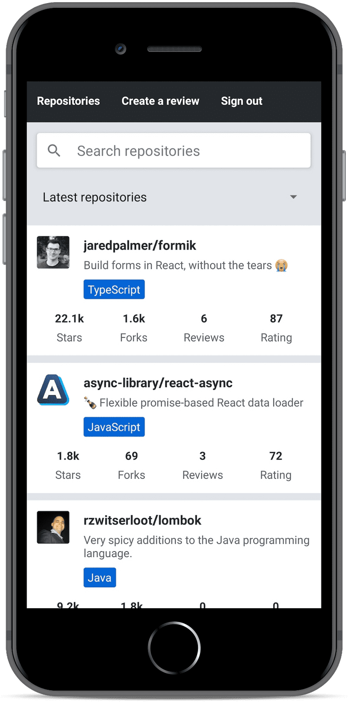

# Rate Repository App

React Native mobile application for rating GitHub repositories developed during the [Full Stack Open 2022](https://fullstackopen.com/en) course by University of Helsinki.

The app was bootstrapped with [Create React Native App](https://github.com/react-community/create-react-native-app) and is running on Expo.

## Configuration

Set up the rate-repository-api server by following the setup instructions in the repository's [README](https://github.com/fullstack-hy2020/rate-repository-api/blob/master/README.md). Note that if you are using an emulator for development it is recommended to run the server and the emulator on the same computer. This eases network requests considerably.

#### To get set up, run the following in your cloned directory

`npm install`

`npm start`

Course material: [https://fullstackopen.com/en/part10](https://fullstackopen.com/en/part10)

Certification: [1359a08d8913a240586f1f63034d09ac](https://studies.cs.helsinki.fi/stats/api/certificate/fs-react-native-2020/en/1359a08d8913a240586f1f63034d09ac)